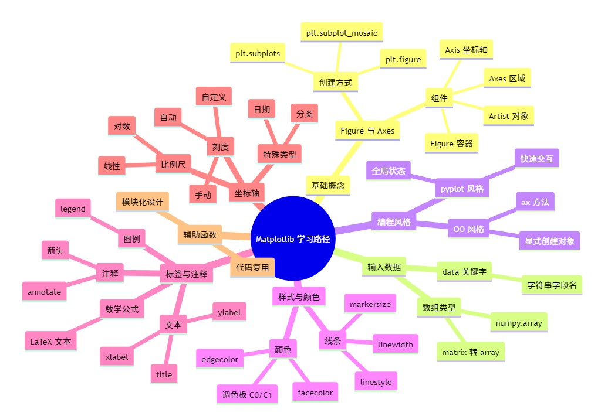

"# matplotlibDemo" 
# Matplotlib 学习示例项目

## 思维导图

## 项目结构简述

- **1.1quick_start_guide.py**: 基础 quick start，展示 `Figure`/`Axes` 的创建与 `subplot_mosaic` 布局。
- **1.2inputs_and_styles_demo.py**: 输入类型与编程风格对比（`matrix→array`、`data` 关键字、OO vs pyplot）。
- **1.3helper_functions_and_styling.py**: 辅助函数 `my_plotter` 复用，Artist 样式设置、颜色与标记示例。
- **1.4labelling_plots_demo.py**: 轴标签/标题/文本、数学公式、注释 `annotate`、图例 `legend` 示例。
- **1.5axis_scales_ticks_and_axes.py**: 比例尺（线性/对数）、刻度（自动/手动）、日期/分类轴、`twinx` 与 `secondary_xaxis`。
- **1.6colormapped_data_demo.py**: 颜色映射数据：`pcolormesh`、`contourf`、`imshow(LogNorm)`、`scatter(c=..., cmap=...)`。

## 环境与运行

1. 安装依赖（建议虚拟环境）：
   - `pip install matplotlib numpy`
2. 运行任意示例：
   - `python 1.1quick_start_guide.py`
   - `python 1.2inputs_and_styles_demo.py`
   - `python 1.3helper_functions_and_styling.py`
   - `python 1.4labelling_plots_demo.py`
   - `python 1.5axis_scales_ticks_and_axes.py`
   - `python 1.6colormapped_data_demo.py`

## 提示

- 在 Jupyter 环境中，通常可省略 `plt.show()`；脚本模式下需保留。
- 若分类轴传入的是数字字符串，可能被当作类别处理，需注意数据类型。